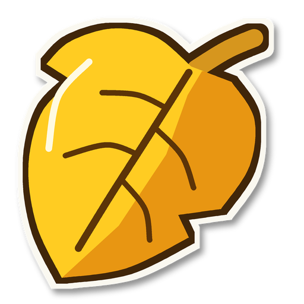

# Featherweight

Featherweight makes Super Smash Bros. Melee custom skins (and stages) lighter, so 4-player matches don't run out of memory and freeze while loading.

## Download

**[Download the latest version](../../releases/latest)**: get `Featherweight.exe` (or the `.zip`) from the release page.

- No install needed. Just run `Featherweight.exe` (Windows 10/11, 64-bit).
- The first time, Windows may say **"Windows protected your PC"** (unknown publisher). Featherweight is a free program without a paid signing certificate. Press **More info**, then **Run anyway**.
- It updates itself: once a day it checks this page, and when a new version is out it offers **Update now**. You can turn that off in **About**.

## How to use

1. Drop in a Melee ISO, one or more skin `.dat` files, or a folder of skins.
2. Pick **Cleanup**, **Solid** (recommended) or **Aggressive**, and check the before/after previews.
3. Press **Make lighter copy**.

It always saves a **new** copy. Your original ISO or skins are never changed. Images are made smaller and 3D models are stored more compactly; bones, weights and animations are never changed.

## Reporting a problem

In Featherweight, press **Report a problem...**. It shows you the whole report first, then **Copy it and open the bug page** copies it and opens this page's [Issues](../../issues/new). Give it a short title and paste the report into the big box.

Reports here are public, so don't include anything private. Featherweight only includes file names (never your folders or user name), and you can untick anything before copying.

## Credits

Made with [HSDRaw (HSDLib)](https://github.com/Ploaj/HSDLib) by Ploaj (MIT) and [SixLabors.ImageSharp](https://github.com/SixLabors/ImageSharp) (Six Labors Split License, Apache 2.0 terms). Full notices are in `THIRD-PARTY.txt` inside the download.

Super Smash Bros. Melee is a trademark of Nintendo. Featherweight is a free fan tool, not made or endorsed by Nintendo, comes with no warranty, and does not include any game files.
